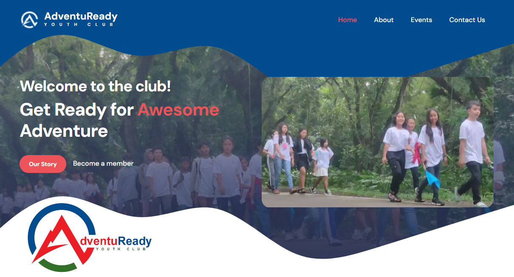

+++
title = "Youth Club's Web App"
date = 2024-05-14T15:29:48+08:00
draft = false
description = ""
slug = ""
tags = ["projects", "multimedia", "web apps", "websites", "templates"]
showTableOfContents = true
+++

<!-- It's been a while since my last drop. Sorry for having no updates for more than 2 months. I wanted to write but I have nothing to write about. Maybe I do have but it's not something I want to share. -->

## The youth club

I'm making the website for [AdventuReady Youth Club](https://www.facebook.com/AdventuReadyYouthClub). I'm also part of the club. For your information, I named it, choose the colors for it and one of the designers of the final logo. It's a competition and I'm one of the winners. We tied on that competition so they decided to combined our ideas for the logo and the name of the club as well as the colors.

## The design
If you don't know, I'm not good with web design. I'm more of a back-end type of web developer so for this project, I downloaded bunch of free website templates for clubs whether it's created with Boostrap or Tailwind CSS.

I modified them so that I can know whether I can work with it or not. We have like a multimedia group chat for the club and I let them choose which template they like via vote. All of them voted for 'Tiya Gold Club' template from [TemplateMo](https://templatemo.com).

## The crew
The thing about this project is that the club's founder gave us a healthy freedom on our tasks. We are a small group so most of time a single person have multiple and different tasks or duty.

## The development
Regarding with the development, I decided to use Next JS and deployed it on Vercel. So from just HTML, CSS (Bootstrap) and JS (jQuery, Modernizr), I transformed it to React JS environment, a Next JS app. And I actually did it!

## The experience
I can't believe it 'cause I'm just getting started with Next JS and React so I'm kind of nervous but I'm also inspired and motivated to the work done. It's definitely a challenge for me, a challenge to expand my craft, to be flexible.

## The next step
So what I finished is the website. It's still pretty static. My next step is the application itself. I haven't study about that but yeah, I'm still in the process.

Next time I'll write more about the club and the web app I'll be making so please stay tuned. Thanks for reading :)